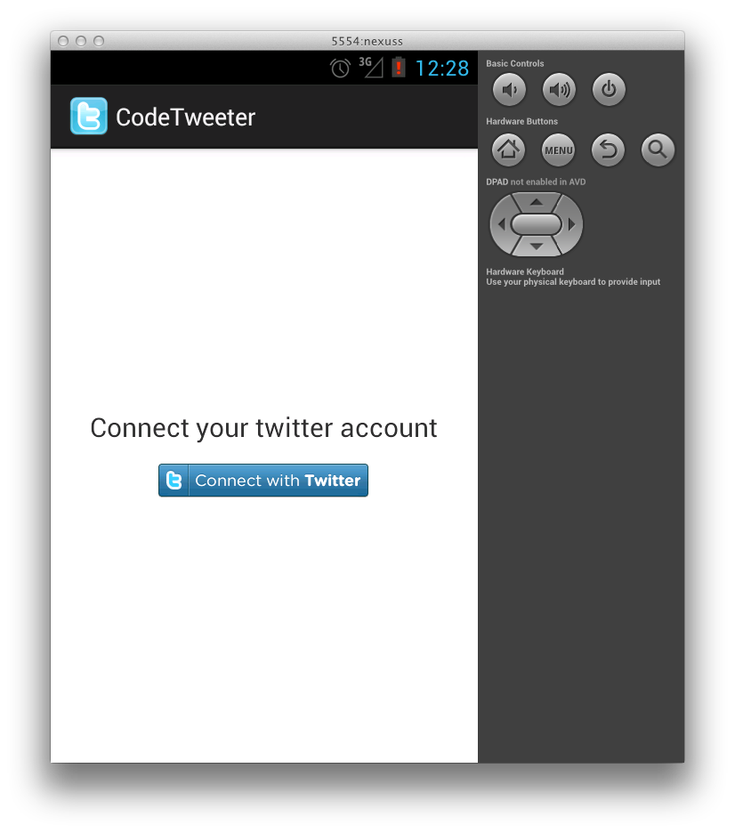
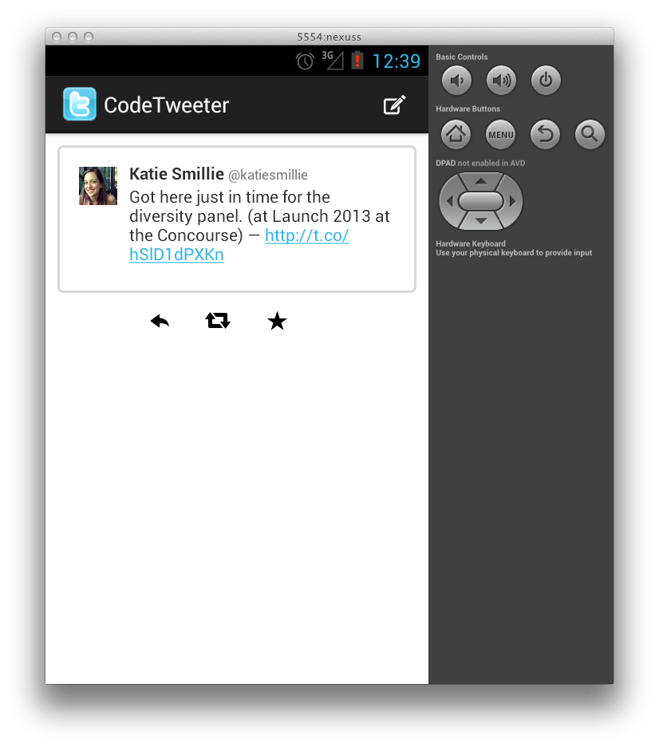
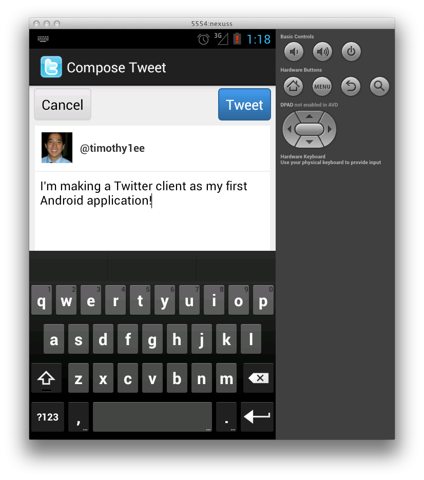
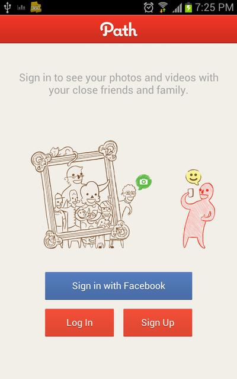

## Android Twitter Project Overview

The goal of this project is to create a basic Twitter client by following a series of exercises. This project is appropriate for someone just starting out with Android development and is following along with the CodePath Android curriculum.

The Twitter client will allow you to log in, view your home timeline, compose a tweet, and view a user profile. Additionally, in the tweet view, you can perform additional actions such as reply, retweet, and favorite.

By the end of this project, you should be familiar with a wide variety of Android concepts that will allow you to build other similar apps such as a Yelp client, an Instagram client, a Mail app, etc. Some of the best apps are a mashup of a few popular APIs!

## Screenshots

Login

Home Timeline

Tweet

Compose

## Exercise 1 - App Fundamentals

The goal of this exercise is to set up the initial project, configure a few application settings in the AndroidManifest.xml, and make some minor modifications to an Activity. You will begin by downloading a starting project that is mostly blank, but includes some libraries to make it easier to work with the Twitter API.

### Tasks

1. Download the initial project [here][1]. 
2. Run the application on your Android phone or the emulator.
3. Modify some application properties
   - Change the name of your Twitter client to one of your choosing.
   - Download an image to use as the app icon.
      - Use the [asset studio][2] to create images with the appropriate dimensions.
4. Create a new activity called LoginActivity
   - Add a TextView
   - Add a Button (the name should be from a string resource)
5. Logging
   - In your LoginActivity, add log messages in the onCreate, onPause, and onResume methods with a tag like "DEBUG".
   - Create a log filter for the LogCat view that only shows log messages with the tag, "DEBUG"
   - Ensure that you can see the activity lifecycle messages in LogCat when you run the application.

### Hints

Use the code below to log a message in an activity.

    Log.d("DEBUG", "This message should appear in the LogCat.");

[1]: https://github.com/thecodepath/codepath_tweets_exercises
[2]: http://android-ui-utils.googlecode.com/hg/asset-studio/dist/icons-launcher.html

## Exercise 2 - User Interface

The goal of this exercise is to implement the basic login view using a few basic views and layouts. You will also integrate with the Twitter library to support logging in to Twitter.

1. Add labels, images, and buttons to create the view of the LoginActivity
   - Must include at least 2 TextViews.  (e.g., a title and a subtitle)
   - Must include a Button or an ImageButton
   - Must use RelativeLayout
   - Experiment with match\_parent vs. wrap\_content
2. Integrate Twitter
   - Modify LoginActivity to subclass OAuthLoginActivity<TwitterClient>
   - Add methods for onLoginSuccess and onLoginFailure
   - Add method, onLoginButton
   - In the layout XML, add the android:onClick property to the button.
   - Clicking on the button should open Chrome and prompt you to login into Twitter.  Upon successfully logging in, you should see, "Successfully logged into Twitter!" in LogCat.

### Hints

Subclassing OAuthLoginActivity

    public class LoginActivity extends OAuthLoginActivity<TwitterClient> {
        @Override
        public void onLoginSuccess() {
            Log.d("DEBUG", "Successfully logged into Twitter!");
        }

        @Override
        public void onLoginFailure(Exception e) {
            Log.d("DEBUG", "Error logging in to Twitter!");
        }

        public void onLoginButton(View view) {
            getClient().connect();
        }
    }

Adding a click handler to a Button via XML

    <Button
        android:layout_width="wrap_content"
        android:layout_height="wrap_content"
        android:onClick="onLoginButton" />

### Benchmarks

See other benchmarks for login screens [here][3].

[3]: http://www.android-app-patterns.com/category/start-screen

## Exercise 3 - Views

The goal of this exercise is to create the activities for the ComposeActivity and the TimelineActivity. The ComposeActivity includes an EditText to collect user input. The TimeLineActivity includes a ListView which will display a list of tweets.

Note: to change which activity launches by default, modify the AndroidManifest.xml and move the intent-filter to the Activity you want to launch. Only put the intent-filter in one Activity.

    <activity
        android:name="com.example.testapp.SecondActivity"
        android:label="@string/title_activity_second" >
        <intent-filter>
            <action android:name="android.intent.action.MAIN" />
            <category android:name="android.intent.category.LAUNCHER" />
        </intent-filter>
    </activity>

1. Create a new activity, ComposeActivity
   - At a minimum, add a Cancel button, a Tweet button, and an EditText control.
   - Experiment with setting the background property to a hex color like "#888888".
   - Experiment with layout_margin and padding.
   - When the ComposeActivity launches, the keyboard should be visible immediately.
   - The screenshot in the benchmarks section should give you an idea of what a compose activity could look like.
2. Create a User class
   - Should include fields and public accessors for screenName, name, and profileImageUrl.
3. Create a Tweet class
   - Should include fields and public accessors for user (of type User), and text.
   - Should include a static method called fakeTweets. The method fakeTweets should return an ArrayList<Tweet> of at least 3 manually created tweets with user objects and text.
4. Create a new activity, TimelineActivity
   - Should include a ListView
   - Create a TweetAdapter with tweets from the Tweet.fakeTweets() method.
   - Set the adapter of the ListView
5. Create a new class, TimelineAdapter that extends ArrayAdapter<Tweet>
   - Create a new layout file called tweet_item.xml that represents the view of a tweet. Should include a layout that contains a TextView for the user's name and a TextView for the tweet.
      - Set background color, margin, padding, font of the layout and TextViews as appropriate.
   - Create a constructor that takes a context and an ArrayList<Tweet>
   - Override the getView method to configure the view of the tweet.

### Hints

Sample constructor of the TimelineAdapter

    public class TimelineAdapter extends ArrayAdapter<Tweet> {
        
        public TimelineAdapter(Context context, ArrayList<Tweet> items) {
            super(context, 0, items);
        }
    }

### Benchmarks

TODO: Add a screenshot w/ a very basic tweet view

## Exercise 4 - Interaction

The goal of this exercise is to handle clicks to various areas of the Twitter app.

- ComposeActivity
   - Hook up the Tweet button to create a new tweet using the text in the EditText control. Print out a message if the post is successful or not. See the hints for an example of how to use the TwitterClient class.
- TimelineActivity
   - When a user taps on a row in the ListView, toast the text of the tweet that they clicked on.

### Hints

Using the Twitter client to post a Tweet.
    
    TwitterClient client = new TwitterClient();
    client.postTweet("This is what I'm tweeting!", new AsyncHttpResponseHandler() {
        public void onSuccess(String jsonTweetString) {
            Log.d("Successfully posted tweet!");
        }

        public void onFailure(Exception e) {
            Log.d("DEBUG", "Post reply error: " + e.toString());
            Toast.makeText(ComposeActivity.this, "Error posting tweet! ", Toast.LENGTH_SHORT).show();
        }
    });

## Exercise 5 - User Flows

The goal of this application is to begin to connect the pieces of the application together.

1. LoginActivity
   - Upon successfully logging in, start the TimelineActivity.
2. Add action bar for compose and refresh
    - Access user info from twitter client to set the title
    - Add items to manu/activity_tweets
    - Implement intent for compose
    - Implement refresh
  - TimelineActivity (tapping to reply)
    - Add onClick listener to ListView
    - Launch a compose w/ embedded replyId and defaultText
    - In ComposeActivity, check for replyId and defaultText
  - Add load more
    - Add footer view to listview
    - Hook up onClick handler, call to twitter.getTimeline(page)
    - adapter.add()

### Hints

## Exercise 6 - Networking

- Handle media tweets
    - Dynamically download and insert images
- Style tweet cells
    - Layout and download profile images

